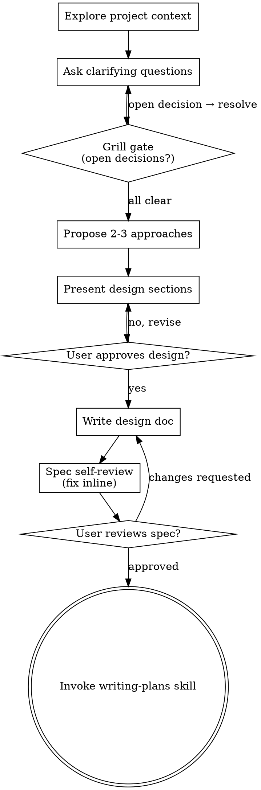

# Brainstorming Ideas Into Designs

Help turn ideas into fully formed designs and specs through natural collaborative dialogue.

Start by understanding the current project context, then ask questions one at a time to refine the idea. Once you understand what you're building, present the design and get user approval.

<HARD-GATE>
Do NOT invoke any implementation skill, write any code, scaffold any project, or take any implementation action until you have presented a design and the user has approved it. This applies to every project that reaches this skill. (Genuinely trivial, mechanical changes — a config value, a style token, a typo, a `.gitignore` line — are triaged out upstream by development-workflow and never reach brainstorming. If you are here, the change is non-trivial: do not wave it away as "too simple.")
</HARD-GATE>

## Anti-Pattern: "This Is Too Simple To Need A Design"

Every project that reaches this skill goes through the design step — a todo list, a single-function utility, a small feature, all of them. The one exception is a genuinely trivial *mechanical* change (no design choice, one obviously-correct outcome), which development-workflow's triage handles directly and never routes here. But anything with a real design decision — however small it looks — is exactly where unexamined assumptions cause the most wasted work. The design can be short (a few sentences), but you MUST present it and get approval. Don't reach for "too simple" to skip a decision that actually has options.

## Entry: idea vs provided spec

Check one observable thing first: **did the user hand you a written spec / requirements doc to implement** (e.g. "implement @spec.md", an attached requirements file)?

- **No — starting from an idea** → run the full Checklist below (dialogue → approaches → design doc).
- **Yes — a spec was provided** → run the **spec-intake path**: their document IS the design. Do NOT generate approaches or author a new design doc — **skip Checklist steps 4–6**. Instead:
  1. Read the spec and explore project context (step 1).
  2. Run the **grill gate against their spec** (step 3): scan it for open decision points, ambiguities, contradictions, missing requirements, and undefined edge cases. If the spec is complete and unambiguous, the grill stays silent — proceed straight on. If it has real gaps, grill them one question at a time (each with a recommended default), and fold the resolved decisions back into the spec.
  3. Spec self-review (step 7): placeholders, internal consistency, scope, ambiguity — fix inline.
  4. Get the user's sign-off on the spec (step 8), then invoke writing-plans pointed at their spec file (step 9).

The HARD-GATE holds on both paths: no implementation until the spec is validated and the user has approved. With a provided spec you *validate their document* instead of authoring one — you never silently start coding just because a spec was attached. When the spec is solid, this path is nearly frictionless: grill stays quiet, self-review passes, sign-off, plan.

## Checklist

You MUST create a task for each of these items and complete them in order:

1. **Explore project context** — use cbm first (`get_architecture` for structure, `search_graph`/`semantic_query` to find relevant code), then check docs and recent commits; Grep/Read only for non-code
2. **Ask clarifying questions** — one at a time, understand purpose/constraints/success criteria
3. **Grill gate** — scan for open decision points; if any remain, grill one question at a time until none do; if none, stay silent and move on. See `skills/brainstorming/grill-gate.md`
4. **Propose 2-3 approaches** — with trade-offs and your recommendation
5. **Present design** — in sections scaled to their complexity, get user approval after each section
6. **Write design doc** — save to `.flow/specs/YYYY-MM-DD-<topic>-design.md` and commit
7. **Spec self-review** — quick inline check for placeholders, contradictions, ambiguity, scope (see below)
8. **User reviews written spec** — ask user to review the spec file before proceeding
9. **Transition to implementation** — invoke writing-plans skill to create implementation plan

## Process Flow

**The terminal state is invoking writing-plans.** Do NOT invoke frontend-design, mcp-builder, or any other implementation skill. The ONLY skill you invoke after brainstorming is writing-plans.

## The Process

**Understanding the idea:**

- Check out the current project state first (files, docs, recent commits)
- Before asking detailed questions, assess scope: if the request describes multiple independent subsystems (e.g., "build a platform with chat, file storage, billing, and analytics"), flag this immediately. Don't spend questions refining details of a project that needs to be decomposed first.
- If the project is too large for a single spec, help the user decompose into sub-projects: what are the independent pieces, how do they relate, what order should they be built? Then brainstorm the first sub-project through the normal design flow. Each sub-project gets its own spec → plan → implementation cycle.
- For appropriately-scoped projects, ask questions one at a time to refine the idea
- Prefer multiple choice questions when possible, but open-ended is fine too
- Only one question per message - if a topic needs more exploration, break it into multiple questions
- Focus on understanding: purpose, constraints, success criteria

**Exploring approaches:**

- Propose 2-3 different approaches with trade-offs
- Present options conversationally with your recommendation and reasoning
- Lead with your recommended option and explain why

**Presenting the design:**

- Once you believe you understand what you're building, present the design
- Scale each section to its complexity: a few sentences if straightforward, up to 200-300 words if nuanced
- Ask after each section whether it looks right so far
- Cover: architecture, components, data flow, error handling, testing
- Be ready to go back and clarify if something doesn't make sense

**Design for isolation and clarity:**

- Break the system into smaller units that each have one clear purpose, communicate through well-defined interfaces, and can be understood and tested independently
- For each unit, you should be able to answer: what does it do, how do you use it, and what does it depend on?
- Can someone understand what a unit does without reading its internals? Can you change the internals without breaking consumers? If not, the boundaries need work.
- Smaller, well-bounded units are also easier for you to work with - you reason better about code you can hold in context at once, and your edits are more reliable when files are focused. When a file grows large, that's often a signal that it's doing too much.

**Working in existing codebases:**

- Explore the current structure before proposing changes. Follow existing patterns.
- Where existing code has problems that affect the work (e.g., a file that's grown too large, unclear boundaries, tangled responsibilities), include targeted improvements as part of the design - the way a good developer improves code they're working in.
- Don't propose unrelated refactoring. Stay focused on what serves the current goal.

## After the Design

**Documentation:**

- Write the validated design (spec) to `.flow/specs/YYYY-MM-DD-<topic>-design.md`
  - (User preferences for spec location override this default)
- Use elements-of-style:writing-clearly-and-concisely skill if available
- Commit the design document to git

**Spec Self-Review:**
After writing the spec document, look at it with fresh eyes:

1. **Placeholder scan:** Any "TBD", "TODO", incomplete sections, or vague requirements? Fix them.
2. **Internal consistency:** Do any sections contradict each other? Does the architecture match the feature descriptions?
3. **Scope check:** Is this focused enough for a single implementation plan, or does it need decomposition?
4. **Ambiguity check:** Could any requirement be interpreted two different ways? If so, pick one and make it explicit.

Fix any issues inline. No need to re-review — just fix and move on.

**User Review Gate:**
After the spec review loop passes, ask the user to review the written spec before proceeding (unless told to auto accept it).
Wait for the user's response. If they request changes, make them and re-run the spec review loop. Only proceed once the user approves.

**Implementation:**

- Invoke the writing-plans skill to create a detailed implementation plan
- Do NOT invoke any other skill. writing-plans is the next step.

## Key Principles

- **One question at a time** - Don't overwhelm with multiple questions
- **Multiple choice preferred** - Easier to answer than open-ended when possible
- **YAGNI ruthlessly** - Remove unnecessary features from all designs
- **Explore alternatives** - Always propose 2-3 approaches before settling
- **Incremental validation** - Present design, get approval before moving on
- **Be flexible** - Go back and clarify when something doesn't make sense
